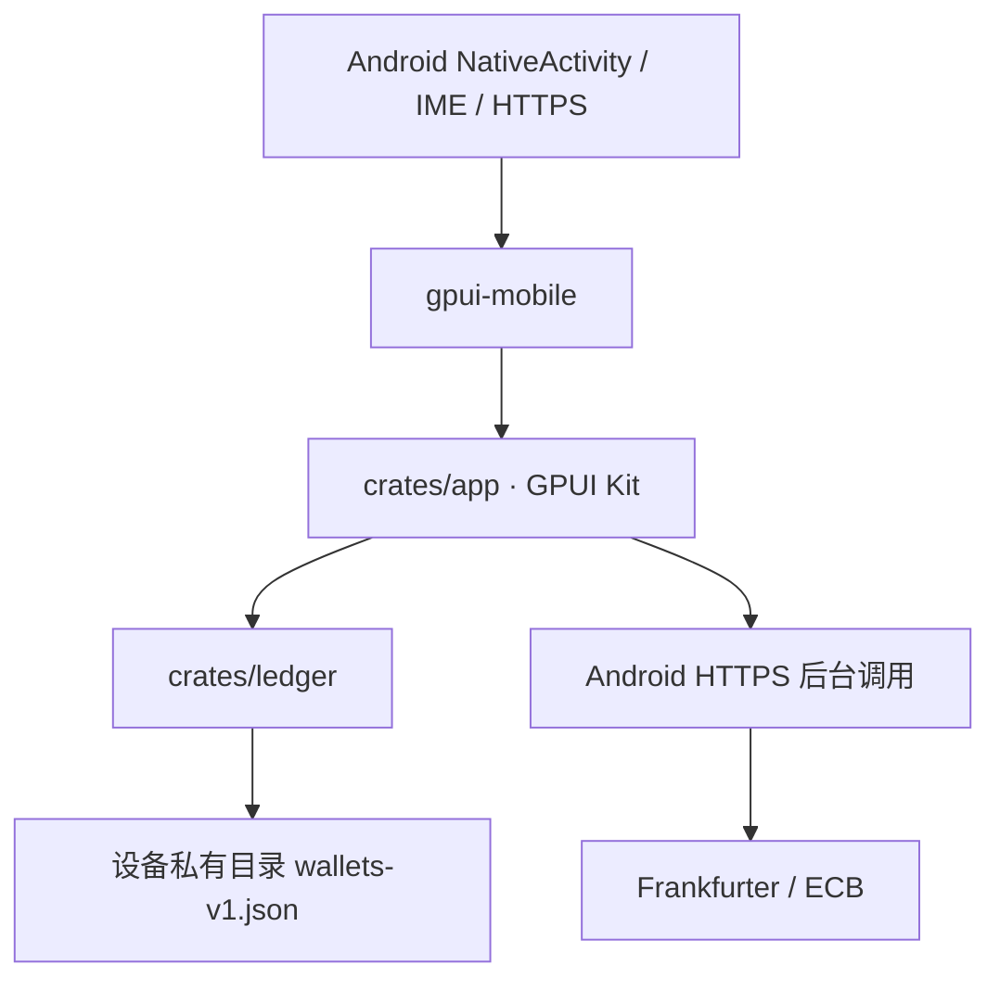

# 架构

`ledger` 不依赖 GPUI 或 Android。金额使用整数分，解析不经浮点数；汇率使用百万分之一精度。每笔操作记录余额、性质与当时汇率，历史收入不会被后续汇率改写。统计按设备本地日期计算，未更新日期沿用余额。

`app` 的 WalletApp 持有界面状态和 Ledger。保存先复制账本，验证并原子写入成功后再替换界面状态。文件损坏时保留原文件并禁止普通写入，仍可从设置导入有效备份恢复。无云端数据服务、用户账号或后台常驻服务。

汇率在后台线程请求，Android 提供证书验证和连接超时。启动时和前台跨日时检查同步日期；请求失败保持缓存，不生成虚假汇率。首次美元钱包要求至少一个有效汇率。应用关闭期间不会定时唤醒；重新打开时补同步。

Android 工程负责包装 Rust 动态库。gpui-kit 固定 0.7.0；gpui-mobile 固定提交 `9075e3aa3eea812127f2c60ed66f0cd5798ff245`。原生控件、图表均由 GPUI 渲染，PNG 仅用于钱包吉祥物和启动图标。Java IME 适配器基于该提交的 GpuiInputActivity 并增加小数键盘、完成键和键盘重新唤起处理；切换布局不新建额外的原生输入会话。

`Backup` 包装完整账本和格式版本。系统文件选择器由 WalletDocuments 处理，文件读写在独立线程进行，JNI 回调用请求 ID 和一次性 channel 返回结果；Rust 后台校验、预览后确认，先持久化导入前快照，再原子替换主账本。导入期间禁止并发保存，代际编号使导入前发出的汇率请求不能覆盖新账本。校验以哈希表按流水单次重放，避免逐条回扫历史。

测试以 ledger 的真实业务序列和持久化重载为主，平台输入、滚动与图表通过 Android 模拟器测试。
